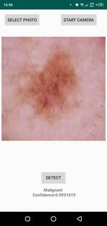

  # LAB 2 : END-TO-END MACHINE LEARNING PROJECT  " FACE DETECTION APPLICATION”
  # LAB 3 : DÉTECTION DU CANCER DE LA PEAU AVEC L'APPLICATION ANDROID
*******************************************************************************************************************************************************************


  # LAB 2 : END-TO-END MACHINE LEARNING PROJECT  " FACE DETECTION APPLICATION”
# Partie 1 
* Feature Engineering:
# Partie 2
* Binary Classification using Scikit-Learn

# Partie 3
* Evaluating the Best Face Detector

# Partie 4 
* Finding Faces in a New Image


# Partie 5 
* Model Deployment with Python and Streamlit


_________________________   ________________________________  _________________________________  _______________________________  _________________________  _______
 
 
 
 # LAB 3 : DÉTECTION DU CANCER DE LA PEAU AVEC L'APPLICATION ANDROID

## Description

Le projet est principalement divisé en deux parties 

# Partie 1 
* TensorFlow & Keras sont utilisés pour construire et créer un modèle de machine learning.
1-Loading the data.

2-Transfer Learning with TensorFlow hub.

3-Data Preprocessing.

4-Build the model.


# Partie 2: Application android 
* TFLite est utilisé pour déployer le modèle sur une application Android.

Nous utiliserons TFLite pour créer une application Android de bout en bout pour ce projet. Nous avons décidé de créer une application Android qui détecte le cancer de la pe
1-Load the model in our Android project.

2-Add TFLite dependency to app/build.gradle file.

3-create a classifier.

4-Recognition is our result data class.

5-convert the preprocessed bitmap into ByteBuffer.


              


### Installing with pip
*  Pour installer tensorflow  vous pouvez utiliser la commande  :
```bash
 npm install tensorflow
```

* Pour installer  keras, vous pouvez utiliser la commande npm fournie avec node.js :
 ```bash
 sudo npm install keras
```
*  Pour installer  pandas  vous pouvez utiliser la commande  :
```bash
 npm install pandas
```

* Pour installer  matplotlib, vous pouvez utiliser la commande npm fournie avec node.js :
 ```bash
 sudo npm install matplotlib 
```
