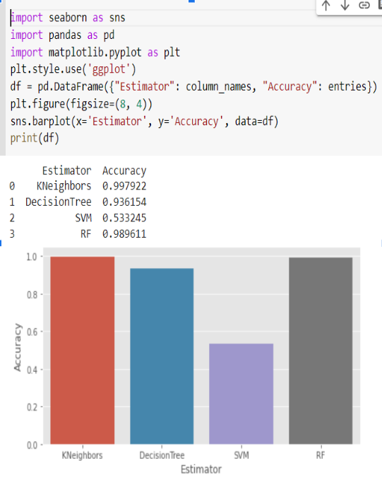
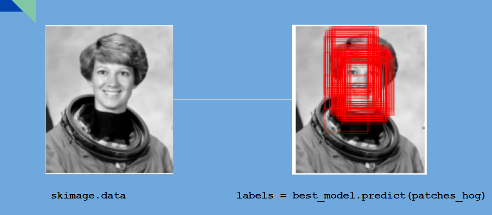

  # LAB 2 : END-TO-END MACHINE LEARNING PROJECT  " FACE DETECTION APPLICATION”

## Description


# Partie 1 
* Feature Engineering:
Dans un premier temps, nous réalisons feature engineering en extrayant l’histogramme d’orientation
Fonctions Gradients (HOG) à l’aide de la bibliothèque Scikit-Image.

# Partie 2
* Binary Classification using Scikit-Learn
-Divisé les données en ensembles de formation et de test.
-Construisons différents classificateurs binaires avec le meilleur estimateur pour chacun.


# Partie 3
* Evaluating the Best Face Detector

# Partie 4 
* Finding Faces in a New Image





# Partie 5 
* Model Deployment with Python and Streamlit


### Installing with pip
*  Pour installer  pandas  vous pouvez utiliser la commande  :
```bash
 npm install pandas
```

* Pour installer  matplotlib, vous pouvez utiliser la commande npm fournie avec node.js :
 ```bash
 sudo npm install matplotlib 
```
